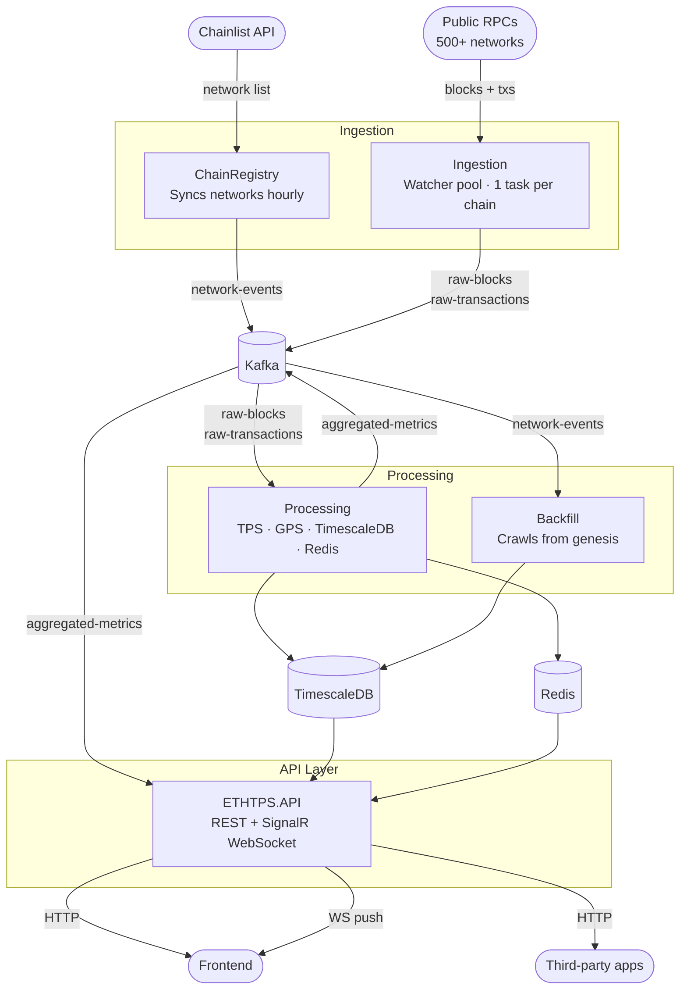

# ETHTPS Backend

Real-time Ethereum network throughput monitor. Tracks transactions per second (TPS) and gas per second (GPS) across Ethereum mainnet and all L2s (~500+ EVM networks sourced from [Chainlist](https://chainlist.org/)), with full historical data from genesis.

---

## Architecture



### Services

| Service | Role |
|---|---|
| **ChainRegistry** | Polls Chainlist hourly, persists network + RPC list, publishes `network-events` to Kafka |
| **Ingestion** | Maintains one async watcher per chain; subscribes to new blocks via WebSocket or HTTP polling; publishes raw blocks + transactions to Kafka |
| **Processing** | Consumes raw blocks, computes per-block TPS/GPS, writes to TimescaleDB, updates Redis live cache, publishes computed metrics to Kafka |
| **Backfill** | Crawls each chain from block 0 to current head, writing directly to TimescaleDB; resumes from checkpoint after restart |
| **API** | ASP.NET Core REST API + SignalR WebSocket hub; anonymous access rate-limited by IP, higher limits with API key |

### Infrastructure

| Component | Purpose |
|---|---|
| **Apache Kafka** | Message bus between all services |
| **TimescaleDB** | Time-series storage for blocks, transactions, and metrics with continuous aggregates at 1m / 5m / 1h / 1d |
| **Redis** | Live TPS/GPS cache per chain; historical query cache; SignalR backplane |

---

## Setup

### Prerequisites

- [Docker](https://docs.docker.com/get-docker/) and [Docker Compose](https://docs.docker.com/compose/) v2.20+
- .NET 10 SDK (only needed to build outside Docker)

### Quick start

```bash
# 1. Clone and enter the repo
git clone https://github.com/your-org/ethtps.git
cd ethtps

# 2. Copy the env file (edit POSTGRES_PASSWORD before deploying publicly)
cp .env.example .env

# 3. Build images and start everything
docker compose up --build
```

On first run Docker will:
1. Start TimescaleDB, Redis, and Kafka
2. Run `kafka-init` to create all topics
3. Build and start all five application services

Allow ~60 seconds for Kafka to be ready and `kafka-init` to complete before the application services connect.

### Ports

| Service | URL |
|---|---|
| REST API | `http://localhost:8090` |
| SignalR hub | `ws://localhost:8090/hubs/metrics` |
| Kafka UI | `http://localhost:8088` |
| TimescaleDB | `localhost:5432` |
| Redis | `localhost:6379` |
| Kafka (host) | `localhost:9094` |

### Infra only (for local development)

```bash
docker compose up timescaledb redis kafka kafka-init kafka-ui
```

Then run individual services from your IDE against `localhost`.

### Rebuilding a single service

```bash
docker compose up --build processing
```

### Scaling to multiple shards

Each of Ingestion, Processing, and Backfill supports splitting the chain ID space across replicas via `ShardChainIdMin` / `ShardChainIdMax`. To run two Ingestion replicas:

```yaml
# docker-compose.override.yml
services:
  ingestion:
    environment:
      Ingestion__ShardChainIdMin: 1
      Ingestion__ShardChainIdMax: 250

  ingestion-2:
    extends:
      service: ingestion
    environment:
      Ingestion__ShardChainIdMin: 251
      Ingestion__ShardChainIdMax: 2147483647
```

Apply the same pattern to `processing` and `backfill`.

---

## API reference

### REST

```
GET /api/v1/networks
GET /api/v1/networks/{chainId}
GET /api/v1/metrics/{chainId}/live
GET /api/v1/metrics/{chainId}/history?from=&to=&resolution=1m|5m|1h|1d
GET /api/v1/metrics/global/live
GET /api/v1/metrics/global/history?from=&to=&resolution=1m|5m|1h|1d
```

Pass `X-Api-Key: <key>` for a higher rate limit (600 req/min vs 60 req/min anonymous).

### WebSocket (SignalR)

Connect to `ws://localhost:8090/hubs/metrics`, then:

```js
// Subscribe to one or more chains
connection.invoke("Subscribe", [1, 10, 42]);

// Receive updates
connection.on("MetricsUpdate", ({ chainId, tps, gps, blockNumber, timestamp }) => {
  console.log(chainId, tps, gps);
});

// Unsubscribe
connection.invoke("Unsubscribe", [42]);
```